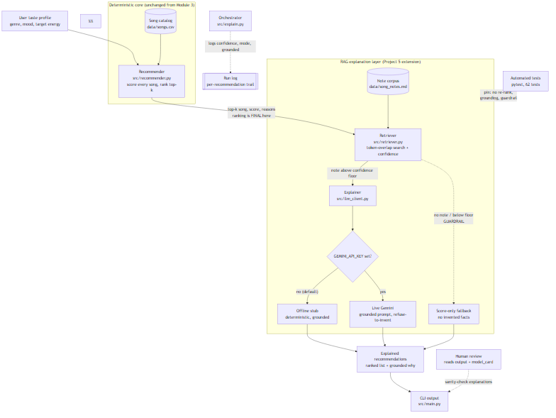

# VibeFinder - Applied AI System (RAG-Extended Music Recommender)

A content-based music recommender that scores each song in a catalog against a
user's "taste profile" (favorite genre, mood, target energy) and returns a ranked
list of suggestions, each with a grounded, natural-language explanation of why it
fits you.

---

# Project 5: Applied AI System

## Original project (Modules 1-3)

This system extends **VibeFinder**, my Module 3 Music Recommender. The original
project was a content-based recommender: it loaded a 20-song catalog, scored every
song against a listener's stated taste profile using a transparent three-term recipe
(genre +2.0, mood +1.0, energy closeness up to +1.0), and returned a ranked top-5
with a rule-based reason for each pick. Its whole point was explainability -- every
number in a recommendation could be traced back to the recipe.

## Summary: what the extended system does and why it matters

For Project 5 I added a **Retrieval-Augmented Generation (RAG)** layer on top of that
recommender. The recommender still decides which songs to suggest and in what order.
The new layer then, for each chosen song, **retrieves** a factual note about it from a
local knowledge corpus and uses a language model to **generate** a short "why this
fits you" that is grounded in that retrieved note. A ranked list with "+2.0 genre
match" is correct but cold; the RAG layer turns it into an explanation a person can
actually read, without letting the model make things up.

The required AI feature is RAG, and it is **fully integrated into the main flow**:
`python -m src.main` produces the explanations by default. The generation runs
**offline and deterministically** with no API key (so it is reproducible for any
reviewer) and upgrades to a live model only when `GEMINI_API_KEY` is set.

## AI feature: Retrieval-Augmented Generation

- **Retrieve** (`src/retriever.py`): a token-overlap search over `data/song_notes.md`
  returns the best-matching note for a song plus a confidence score (0.0-1.0).
- **Augment + Generate** (`src/llm_client.py`): the retrieved note is the ONLY factual
  context handed to the explainer. In offline mode a deterministic stub composes the
  explanation from the note's first sentence plus the match reasons; in live mode a
  Gemini prompt is hard-constrained to the note and told to refuse rather than invent.
- **Orchestrate** (`src/explain.py`): ties recommend -> retrieve -> explain together,
  logs one line per recommendation (confidence, mode, whether it was grounded), and
  returns structured results.

**The central guardrail: the LLM explains, it never re-ranks.** The deterministic
score is decided before the explainer ever runs and is only read, never changed. If
retrieval finds no note above the confidence floor, the system falls back to a
score-only explanation instead of describing a song it has no facts for. Both
properties are pinned by tests.

## Architecture Overview

The system is two layers. The **deterministic core** (unchanged from Module 3) loads
`data/songs.csv`, scores and ranks the songs, and produces the final ordering. The
**RAG layer** takes that already-ranked list and attaches an explanation to each pick:
the retriever pulls the relevant note from `data/song_notes.md`, and the explainer
(offline stub or live Gemini) phrases a grounded "why," falling back to score-only if
no note is confident enough. Automated tests and human review sit on the output to
confirm the explainer never changed the ranking and never invented facts. The full
diagram source is in [`diagrams/architecture.mmd`](diagrams/architecture.mmd)
(rendered below).



## Setup and Run

```bash
pip install -r requirements.txt

# Default: runs fully offline, deterministic, no API key needed.
python -m src.main

# Run the tests (62 tests, all offline).
python -m pytest

# Optional live mode: set a key to have Gemini phrase the explanations.
# (Offline stub is used automatically if this is unset or google-genai is absent.)
pip install google-genai

# Provide the key either as an environment variable ...
export GEMINI_API_KEY=your_key_here      # PowerShell: $env:GEMINI_API_KEY="..."
                                         # Command Prompt: set GEMINI_API_KEY=...
# ... or, to avoid retyping it, copy .env.example to .env and put the key there.
# .env is gitignored, so the key is never committed; main.py loads it automatically.
python -m src.main
```

## Sample Interactions (RAG output, captured from `python -m src.main`)

Full captured run: [`assets/sample_run.txt`](assets/sample_run.txt).

**Example 1 -- default profile (pop / happy / energy 0.8).** Both pop/happy songs
match on all three terms; the explanation is grounded in each song's note:

```
=== Recommendations for the default profile (pop / happy) [RAG] ===
1. Summer Anthem  (score 4.00)
     - genre match (+2.0)
     - mood match (+1.0)
     - energy close to target (+1.00)
     why: Summer Anthem: An upbeat pop anthem by Coast Kids, high energy at 0.80 and a danceable 120 BPM. It matched on your favorite genre, the mood you asked for, and your target energy.
          [grounded on 'Summer Anthem', confidence 1.00]
2. Sunshine Pop  (score 3.95)
     - genre match (+2.0)
     - mood match (+1.0)
     - energy close to target (+0.95)
     why: Sunshine Pop: A bright, upbeat pop track by The Brights. It matched on your favorite genre, the mood you asked for, and your target energy.
          [grounded on 'Sunshine Pop', confidence 0.67]
```

**Example 2 -- Chill Lofi (lofi / chill / energy 0.30).** A different corner of taste
space; note how the two partial matches below are explained honestly -- #2 matches
genre but not mood, #3 matches mood but not genre:

```
=== Chill Lofi (lofi / chill / energy 0.30) [RAG] ===
1. Lofi Rain  (score 4.00)
     - genre match (+2.0)
     - mood match (+1.0)
     - energy close to target (+1.00)
     why: Lofi Rain: A calm lofi beat by Study Cat, low energy at 0.30 and a slow 72 BPM. It matched on your favorite genre, the mood you asked for, and your target energy.
          [grounded on 'Lofi Rain', confidence 0.67]
2. Study Fog  (score 2.98)
     - genre match (+2.0)
     - energy close to target (+0.98)
     why: Study Fog: A lofi track built for the background, mellow and low-key at 0.28 energy over a slow 74 BPM. It matched on your favorite genre, and your target energy.
          [grounded on 'Study Fog', confidence 0.50]
3. Underwater Bloom  (score 1.90)
     - mood match (+1.0)
     - energy close to target (+0.90)
     why: Underwater Bloom: A dreampop track with a chill mood, gentle at 0.40 energy and a 100 BPM drift. It matched on the mood you asked for, and your target energy.
          [grounded on 'Underwater Bloom', confidence 0.50]
```

**Example 3 -- the guardrail firing (song with no note).** When retrieval finds no
note above the confidence floor, the system refuses to describe the song and falls
back to a score-only line (captured in [`assets/guardrail_demo.txt`](assets/guardrail_demo.txt)):

```
Retrieval for a song with no note:
  note found: False   confidence: 0.0   matched: None
  explanation: Untitled Demo: recommended on the score alone (energy close to target (+0.50)).
```

## Reliability and Guardrail Evidence

The RAG run ends with a reliability summary, and the test suite pins the guarantees:

```
### RELIABILITY SUMMARY (RAG layer) ###
10/10 explained recommendations were grounded on a retrieved note; average retrieval confidence 0.58; explainer mode = offline.
Guardrail: any recommendation with no note above the confidence floor falls back to a score-only explanation instead of inventing details.
```

```
$ python -m pytest -q
62 passed
```

| What is tested | Where | Result |
| --- | --- | --- |
| Every catalog song has a note and retrieves it | `test_retriever.py` | Pass |
| A song with no note falls back (guardrail) | `test_retriever.py`, `test_explain.py` | Pass |
| Offline explanation is deterministic | `test_explain.py` | Pass |
| Explanation is grounded in the note (no decimal/initial truncation) | `test_explain.py` | Pass |
| LLM layer never re-ranks (order + scores unchanged) | `test_explain.py` | Pass |

Test log: [`assets/pytest_summary.txt`](assets/pytest_summary.txt).

## Design Decisions and Trade-offs

- **RAG instead of a chatbot.** The recommender is the product; the AI's job is to
  explain its output trustworthily, not to replace the scoring. So the LLM sits
  downstream of a fixed ranking rather than driving it.
- **Offline stub by default.** Requiring an API key would make the project
  unreproducible for a grader. The deterministic stub means the system, its output,
  and its tests are identical on any machine; live Gemini is a strict upgrade, not a
  dependency. Trade-off: the offline wording is templated rather than fluent.
- **Token-overlap retrieval, not embeddings.** For a 20-song catalog, embeddings would
  be gold plating. A transparent overlap score is easy to log, test, and reason about.
- **Explain, never re-rank.** Keeping the LLM strictly downstream is what makes the
  system auditable: the ranking is always the deterministic recipe, and a test proves
  the explainer cannot change it.

### How the song categories are grounded

The catalog's `genre / mood / energy` schema is a deliberate, principled simplification
of how the music industry and music-information-retrieval (MIR) research categorize
tracks, not an ad-hoc choice:

- **Genre** follows the standard "one label from a bounded list" pattern. The canonical
  MIR benchmark, the GTZAN genre collection, uses a fixed set of 10 genres (blues,
  classical, country, disco, hip-hop, jazz, metal, pop, reggae, rock); this catalog
  covers all 10 plus a few adjacent labels (synthwave, lofi, edm, r&b, and others).
- **Energy** (0.0-1.0) matches Spotify's `energy` audio feature exactly in both concept
  ("perceptual intensity and activity") and scale, so this dimension mirrors a
  production system rather than inventing a metric.
- **Mood** is a single word from the common vocabulary seen in mood-tagged datasets
  (happy, sad, calm, energetic, chill, romantic...). This is a documented simplification:
  Spotify has no single mood field and instead derives mood from `valence` + `energy`,
  a 2-D model (Russell's valence-arousal circumplex). A single mood word collapses that
  plane to one point, so, for example, "sad" (low energy, low valence) and "angry" (high
  energy, low valence) are not cleanly separated. The natural upgrade -- out of this
  project's scope -- is to add a `valence` 0.0-1.0 field to recover the mood quadrant.

In short, `energy` is modeled the industry-standard way, `genre` mirrors the most-cited
MIR benchmark, and `mood` is a lightweight, interpretable stand-in for the valence axis.

Sources: GTZAN genre collection (Tzanetakis & Cook, 2002); Spotify Web API audio-features
reference (`energy`, `valence` definitions); Russell's circumplex model of affect (1980,
the valence-arousal basis for the mood quadrant).

## Testing Summary

62 automated tests pass (up from 50 in Module 3): the original 50 recipe/evaluation/
diversity tests plus 12 new ones for retrieval, grounding, the guardrail fallback, and
the no-re-rank guarantee. What worked: the offline stub made the whole feature testable
without a network, and the no-re-rank test caught exactly the risk that worried me.
What did not, at first: the offline explainer truncated notes on decimal points and on
an artist's initial ("A. Keys Trio") -- it ran without error but produced wrong text,
which I only caught by reading the output. Both are now fixed and pinned by a test.

## Reflection

My graded responsible-AI reflection -- how I collaborated with AI (one helpful and one
flawed suggestion), the system's limitations and biases, misuse and prevention, and
what surprised me in testing -- is in [`model_card.md`](model_card.md).

---

## How The System Works

### What a recommender does

A recommender system suggests items a person is likely to enjoy typically based on 
prior likes or interactions. Streaming services like Spotify and Netflix do this constantly: out of large libraries they surface the handful of songs or shows most relevant to you. VibeFinder is a small, transparent version of the same idea, built for a fixed catalog of
songs.

### Two common approaches

Real-world recommenders are usually built one of two ways.

- **Collaborative filtering** learns from the behavior of many users. It looks
  at what large numbers of people liked, skipped, replayed, or added to
  playlists, and finds patterns across those users. The core idea is "people
  who behaved like you also enjoyed this." For example, Spotify's Discover
  Weekly can recommend a track simply because listeners with taste similar to
  yours keep saving it, even without knowing anything about how the song
  sounds. This approach needs a large history of user interactions to work.
- **Content-based filtering** matches the features of the items themselves to a
  user's stated preferences. It does not need other users at all. The core idea
  is "this item's attributes line up with what you said you want." For example,
  you tell a service you like calm acoustic music, and it scores each song by
  how well its genre, mood, and energy fit that description. This approach needs
  good item features and a clear preference to compare against.

### Improving either approach (a requirements lens)

Both descriptions above focus on how the software works: one tracks user
behavior, the other matches item attributes. From a requirements point of view,
that is only half the picture. Three principles from software requirements
practice show how either approach can be improved, and they also explain why
VibeFinder is intentionally simple.

- **Start from the user's goal, not the mechanics.** A recommender is only truly
  complete when it serves the user's actual objective, not just a list of
  system behaviors. The same engine should prioritize differently
  depending on why the person wants a recommendation right now -- for example
  "help me focus while I study" versus "show me new artists I have not heard."
  Defining that goal first is what tells the algorithm what to optimize.
- **Close the expectation gap with feedback.** An algorithm can be
  mathematically optimal and still miss what the user actually wanted, which
  leaves an expectation gap. Real systems narrow it
  with frequent contact points: letting users rate or skip results, adjust
  parameters (such as a target-energy slider), or react to a prototype, then
  feeding that back in. VibeFinder deliberately does not do this yet -- it runs
  once from a static profile with no feedback loop -- so this is an honest
  limitation and a clear direction for improvement rather than something the
  current version claims.
- **Separate attractive features from real value.** A recommendation engine is a
  product feature, and every mechanism should trace back to a validated user
  task and a justification. A complex collaborative
  filtering model is not automatically more valuable; building one the user did
  not need is gold plating. When the user's goal is quick, explainable
  vibe-matching, a simple content-based score delivers more value at far less
  cost. That trade-off is the reason VibeFinder's simple design is a deliberate
  choice, not a shortcut.

### Which approach VibeFinder uses, and why

VibeFinder uses **content-based filtering**.

This is a deliberate choice forced by the data we have. VibeFinder has no record
of how anyone has ever listened -- there are no likes, skips, play counts,
ratings, or playlists to learn from. Collaborative filtering is therefore not
possible here, because there is no crowd of user behavior to find patterns in.
What VibeFinder does have is a catalog where every song is described by concrete
features, plus a single user's stated taste profile. It compares the two
directly: for each song it measures how well the song's features match the
profile, produces a score, ranks the songs by that score, and returns a short
list of the best matches with a plain-language reason for each.

### Song features (what VibeFinder knows about each song)

Each song in the catalog is described by these features:

- **title** -- the song's name.
- **artist** -- the performer.
- **genre** -- the musical category (for example pop, rock, lofi, jazz).
- **mood** -- the emotional feel (for example happy, chill, intense, calm).
- **energy** -- how energetic the track is, on a 0.0 to 1.0 scale, where higher
  means more energetic.
- **tempo_bpm** -- the tempo in beats per minute (a whole number).
- **popularity** -- a crowd-popularity value on a 0.0 to 1.0 scale, where higher
  means more widely popular. It is recorded for every song but is deliberately
  NOT scored by the recipe (see the note under Algorithm Recipe).

### UserProfile features (what VibeFinder knows about you)

A user's taste profile has three preferences, which songs are matched against:

- **favorite_genre** -- the genre the listener most wants to hear.
- **favorite_mood** -- the mood the listener is in the mood for.
- **target_energy** -- the listener's preferred energy level, on the same 0.0
  to 1.0 scale as a song's energy.

### Algorithm Recipe (how the score is calculated)

VibeFinder scores every song against your taste profile (favorite genre,
favorite mood, and a target energy from 0.0 to 1.0), then ranks the highest
scorers. A song's score is the sum of exactly three terms, for a maximum of
**4.0 points** (2.0 + 1.0 + 1.0):

- **Genre match (+2.0).** The song's genre must exactly equal your
  `favorite_genre`. It is all-or-nothing: +2.0 on an exact match, otherwise 0.
  Genre is weighted twice as heavily as the other terms because it is the
  strongest single signal of whether a song fits the vibe you asked for.
- **Mood match (+1.0).** The song's mood must exactly equal your
  `favorite_mood`. Also all-or-nothing: +1.0 on an exact match, otherwise 0.
- **Energy closeness (up to +1.0).** This term rewards how CLOSE a song's energy
  is to your target energy, not how high its energy is. It is computed as
  `1.0 * max(0, 1 - |song_energy - target_energy|)`. A song sitting right on
  your target earns the full +1.0; the score shrinks as the gap widens and
  reaches 0 once the difference is 1.0 or more. The direction does not matter --
  a low target-energy rewards calm songs exactly as much as a high target-energy
  rewards intense ones. Because energy is continuous, this term almost always
  contributes something, so it acts as the natural tie-breaker between songs
  that match on genre and mood.

The `tempo_bpm` feature is recorded for every song but is likewise not scored: it
correlates closely with energy, so scoring it would double-count that same signal.

**Worked example.** Using the default profile (genre `pop`, mood `happy`,
target energy `0.8`), two songs both match perfectly on genre and mood, so
energy closeness alone decides the order:

```
Summer Anthem  genre +2.00 | mood +1.00 | energy +1.00  (|0.80 - 0.80| = 0.00) = 4.00
Sunshine Pop   genre +2.00 | mood +1.00 | energy +0.95  (|0.85 - 0.80| = 0.05) = 3.95
```

"Summer Anthem" wins by 0.05 purely because its energy lands exactly on the
target. A tiny number decides the ranking. When two songs tie on the total
score, VibeFinder keeps the catalog's original order (a stable sort), so the
ranking is deterministic.

**How a recommendation is explained.** Each result carries a short reasons list
naming only the terms that fired, for example `genre match (+2.0)`,
`mood match (+1.0)`, `energy close to target (+0.94)`. The energy reason always
appears; the genre and mood reasons appear only on an exact match. By design the
component values in the reasons list always add up to the displayed total score,
so every recommendation's explanation adds up to the number you see. (This
summing guarantee is enforced by a Phase 3 test.)

> **Note -- popularity is deliberately NOT scored.** The catalog carries a
> `popularity` value (0.0 to 1.0) per song, but it is excluded from the shipped
> recipe above by design. VibeFinder's job is to match one listener's taste and
> mood, and popularity is a crowd signal that says nothing about whether a song
> fits THIS user; scoring on it would bury niche, perfect-fit songs under chart
> hits (a filter-bubble, rich-get-richer effect). The column is kept in the data
> on purpose so Phase 4 can switch it on inside a controlled experiment, measure
> that bias directly, and then revert it. See the Phase 4 bias study.

### Expected Biases

Bias can enter from two places: the scoring rule itself, and the songs we chose
to score. The four biases below are predictions we make from the design and the
catalog, stated up front. Each is a hypothesis that Phase 4 tests directly, where
the measured results and any surprises are reported.

**Biases from the scoring recipe (the math)**

- **Genre dominance.** Genre is worth +2.0, double the weight of mood (+1.0) or a
  perfect energy match (+1.0). A song that matches your genre usually outranks a
  song that misses genre but matches mood and energy. In the closest case a genre
  match scores at least 2.0, while the best a non-genre song can reach (perfect
  mood +1.0 plus perfect energy +1.0) is also 2.0, so the genre song ties at
  worst and wins whenever its energy is even slightly close to your target. We
  expect genre to dominate the rankings; Phase 4 will measure how often the top
  result simply shares the profile's genre.
- **Popularity bias (held out by design).** Popularity is a column in the catalog
  but is deliberately excluded from the shipped recipe (the three terms are genre,
  mood, and energy only, maxing at 4.0). We designed it out on purpose, and we
  gave several niche perfect-match songs a low popularity, so a popularity term
  would bury exactly the songs a content-based recommender should surface (a
  filter-bubble, rich-get-richer effect). Phase 4 switches popularity on inside a
  controlled experiment to demonstrate this bias, measures how far the niche
  matches drop, then reverts it so the final product stays popularity-free.

**Biases from the catalog (the data)**

> Note: the two data biases below described the ORIGINAL 20-song catalog. Project 5
> expanded the catalog to 46 songs, rebalancing genres (every genre now has 2-3
> songs, all 10 GTZAN genres covered) and giving every mood at least 3 songs. Both
> data biases are therefore largely resolved; they are kept here as the baseline the
> expansion addressed.

- **Composition skew (original catalog).** The original 20 songs were not evenly
  balanced -- they skewed toward pop and high-energy tracks. We expected popular,
  high-energy profiles to get richer results than niche profiles simply because
  there were more songs to match. (Note this is a property of the data, not the
  recipe: the energy term still rewards closeness to your target, not high energy.)
  The 46-song catalog spreads genres and energy more evenly, so this skew is largely
  corrected.
- **Thin-mood coverage (original catalog).** In the original 20 songs, four moods
  appeared on only one song each: dreamy, intense, mellow, and sad. A profile asking
  for one of those had almost nothing to match on. The expansion gives every mood at
  least 3 songs, so this thin coverage is resolved.

## Run it

```bash
pip install -r requirements.txt
python -m src.main
```

> The rest of this section documents the **core recipe** in isolation (the Module 3
> behavior). Since Project 5, `python -m src.main` also attaches the RAG explanations
> shown in the Project 5 section above; the ranking below is unchanged -- the
> explainer only adds prose on top of it.

## Sample Recommendation Output (core recipe, score-only)

The default profile (genre pop, mood happy, target energy 0.8) produces this ranking.
Three pop/happy songs tie on genre and mood, so the energy-closeness term alone orders
them: Summer Anthem (energy 0.80, right on the target) edges out Sunshine Pop (0.85)
and Confetti Skies (0.72):

```
Loaded songs: 46

=== Recommendations for the default profile (pop / happy) ===
1. Summer Anthem  (score 4.00)
     - genre match (+2.0)
     - mood match (+1.0)
     - energy close to target (+1.00)
2. Sunshine Pop  (score 3.95)
     - genre match (+2.0)
     - mood match (+1.0)
     - energy close to target (+0.95)
3. Confetti Skies  (score 3.92)
     - genre match (+2.0)
     - mood match (+1.0)
     - energy close to target (+0.92)
4. Velvet Hustle  (score 2.00)
     - mood match (+1.0)
     - energy close to target (+1.00)
5. Mirrorball Fever  (score 1.95)
     - mood match (+1.0)
     - energy close to target (+0.95)
```

The three pop/happy songs (each 3.9+) sit far ahead of songs 4 to 5, which are
disco/happy tracks matching the mood but not the genre (so no +2.0 term). This is
the genre-dominance effect described under Expected Biases: any full genre+mood match
jumps far ahead of a mood-only or energy-only match.

## Optional Extension: Genre Diversity Re-Ranking

This is an optional extension, kept deliberately OUTSIDE the shipped recipe. It
targets the genre-dominance bias documented under Expected Biases -- two
near-identical pop hits crowding the top of a pop/happy ranking -- and asks a
different question than the recommender itself: instead of "what fits my vibe,"
it asks "show me a spread of genres."

**What it does.** `src/diversity.py` takes the already-ranked
`(song, score, reasons)` list from `recommend_songs`, walks it top to bottom, and
keeps a song only while its genre has been kept fewer than `max_per_genre` times.
It is a post-ranking SELECTION step, a side-car that sits beside the recipe
exactly as the popularity experiment does. Scores and reasons pass through
completely unmodified; `src/recommender.py` is never touched, so the extension
deletes cleanly -- remove the file and the recommender is exactly as it was.

**Why it is NOT a scoring term.** Diversity could not be folded into the score
without breaking a guarantee the model card defines as the testable meaning of
"transparent." A diversity bonus would push a score above the fixed 0.0 to 4.0
scale, and a penalty would subtract points that no reason string accounts for,
breaking the "the reasons always sum to the score" guarantee. The only honest
place for it is a selection step layered on top of the finished ranking, where it
never goes near a score.

**How to run it.**

```bash
python -m src.diversity
```

**BEFORE / AFTER (default profile, pop / happy / 0.80, max_per_genre=1).**

```
#  BEFORE (pure recipe)              AFTER (one per genre)
1  Summer Anthem [pop] 4.00          Summer Anthem [pop] 4.00
2  Sunshine Pop [pop] 3.95           Velvet Hustle [disco] 2.00
3  Confetti Skies [pop] 3.92         Midnight Drive [synthwave] 0.95
4  Velvet Hustle [disco] 2.00        Crown Season [hip-hop] 0.95
5  Mirrorball Fever [disco] 1.95     Static Rebellion [rock] 0.95
```

**Two honest findings.** Both argue for keeping the extension out of the shipped
recipe.

- **A cap of 2 was dead code on the original catalog, and the catalog SIZE is what
  changed that.** On the original 20-song catalog every genre had at most 2 songs, so
  across all 231 (genre, mood, energy) profiles no top-5 ever held 3 of one genre and
  a cap of 2 could never fire -- it was dead code, and only a cap of 1 did anything.
  After Project 5 expanded the catalog to 46 songs, several genres have 3 entries, so
  the default pop/happy top-5 now holds THREE pop songs and a cap of 2 fires (it drops
  the third pop song). The lesson is that the knob's usefulness was gated by catalog
  size, not by the algorithm -- which is exactly why a bigger, balanced catalog matters.
- **A cap of 1 is not free.** On the default profile it demotes Sunshine Pop (3.95)
  and Confetti Skies (3.92), two genuine pop/happy matches, and promotes Velvet Hustle
  at 2.00 -- a disco song that matches the listener's mood but NOT their genre. That is
  a ~1.95-point quality cost at slot 2 for one extra genre. It does curb the
  genre-dominance bias, but it spends the listener's stated taste on variety they did
  not ask for. That trade is why the shipped `recommend_songs` is left unchanged and
  diversity stays a separate, optional module.

## Testing

```bash
python -m pytest
```

The test suite is a quality add -- the assignment does not require tests, but they
act as a reproducibility and regression guard and double as an executable
specification of the recipe. There are 62 tests across five files. `tests/`
`test_recommender.py` covers the core recipe, `tests/test_evaluation.py` covers
the Phase 4 evaluation profiles and the popularity experiment,
`tests/test_diversity.py` covers the genre diversity re-ranking side-car, and
`tests/test_retriever.py` and `tests/test_explain.py` cover the Project 5 RAG layer
(retrieval, grounding, the no-note guardrail, and the never-re-rank guarantee).
Together they cover:

- **Loading:** the real catalog loads exactly 20 rows with the right types;
  genre and mood are lower-cased; and malformed rows (a non-numeric cell, a short
  row, a blank line) are skipped rather than crashing the load.
- **Scoring:** a perfect match scores 4.00; matching is case-insensitive; the
  energy term is symmetric around the target; a genre match (+2.0) outranks a
  mood-only match (+1.0); missing fields and unknown genres degrade gracefully
  instead of raising.
- **The explainability guarantee:** the numeric values in the reasons list always
  sum to the total score, checked across many song and profile combinations
  (including an off-round energy value).
- **Ranking:** `recommend_songs` returns at most k, in non-increasing score
  order, handles an empty catalog and an empty-genre profile, and is
  deterministic -- exact score ties keep the catalog's original order, and the
  caller's catalog is never reordered.
- **Evaluation and experiment:** the energy-ceiling winner flip, the ghost-genre
  term going dead, the conflicted profile still ranking the unique categorical
  match first, and three popularity-experiment guards (the #1 is never dethroned,
  niche near-matches are buried while pop hits are lifted, and the pure recipe is
  never touched or the catalog mutated).
- **Diversity re-ranking:** the exact default-profile BEFORE/AFTER at cap 1;
  scores and reasons pass through as the same objects; neither the input list nor
  any song dict is mutated; the dead-cap no-op (cap 2 is byte-for-byte the
  baseline, pinned so nobody quietly re-defaults it); the empty-result edge cases
  (`k <= 0`, `max_per_genre <= 0`); an unreachable k returns fewer than k rather
  than relaxing the cap; a missing `genre` key does not crash; and stability
  (kept songs preserve their relative order).
